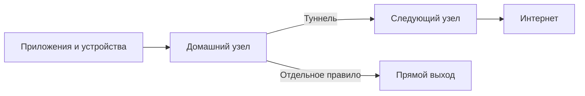

# Фарватер · Farvater

**Своя сеть. Свои узлы. Понятные маршруты.**

Фарватер помогает управлять тем, куда идёт трафик ваших приложений и устройств.
Поставьте узел на Linux-сервер или Mac mini, задайте правила в веб-панели
и соедините несколько машин в туннельную цепочку. У каждого узла — собственная
политика, входы и выходы.

[Начать установку](docs/README.md) · [Документация](docs/README.md) ·
[Релизы](https://github.com/SVS696/farvater/releases) · [Для разработчиков и агентов](CONTRIBUTING.md)




## Что можно сделать

- **Выбрать путь для трафика.** Направлять домены и устройства через нужный выход,
  оставляя локальные ресурсы на прямом маршруте. Возможности зависят от режима узла.
- **Соединить свои машины.** Использовать другой узел как следующий переход
  цепочки; каждый узел может работать самостоятельно.
- **Управлять DNS и подключениями.** Менять правила из панели, видеть состояние
  и на Linux использовать фильтрацию AdGuard и нативные VPN-службы.
- **Проверить изменения до закрепления.** Временное применение требует
  подтверждения; при истечении срока прежняя конфигурация возвращается.
- **Подготовиться к восстановлению.** Linux-установка поддерживает зашифрованные,
  подписанные резервные копии и отдельный доступ к восстановлению.

## Выберите режим

| Задача | Где запускать | Инструкция |
|---|---|---|
| Локальный DNS и SOCKS/HTTP, собственные правила выходов | macOS или Linux, Python 3.11+ | Быстрый старт ниже |
| Полный сервер с VPN-службами и восстановлением | Linux amd64 с systemd; проверен Ubuntu 24.04 | [Установка Linux](docs/linux.md) |
| Системный VPN и шлюз для клиентской LAN | Выделенный Mac с двумя физическими интерфейсами | [Экспериментальный шлюз macOS](docs/macos-gateway.md) |
| Панель для существующего Linux-узла через SSH | macOS или Linux | [Режим удалённой панели](docs/macos.md) |

**Текущий выпуск — alpha.** Локальный узел проверен на Mac arm64, полный Linux-сервер —
на Ubuntu 24.04 amd64. Для системного и LAN-шлюза macOS пока выполнены проверки
кода и конфигурации; работа с реальными сетевыми интерфейсами ещё не подтверждена.
Windows как платформа узла не поддерживается. Подробнее: [совместимость и проверки](docs/validation.md).

## Запустить локальный узел

Этот вариант поднимает DNS, SOCKS/HTTP и панель без административных прав.
Он подходит для знакомства с Фарватером и приложений, которым можно указать прокси.

В терминале из каталога проекта:

```sh
git clone https://github.com/SVS696/farvater.git
cd farvater
python3 -m venv .venv
.venv/bin/python -m pip install --require-hashes -r requirements.txt
.venv/bin/python tools/download_core.py --destination "$HOME/.local/share/farvater/core"
.venv/bin/python tools/local_node.py init --core "$HOME/.local/share/farvater/core/sing-box" \
  --probe-domain example.com --probe-url https://example.com/
.venv/bin/python tools/local_node.py serve
```

Инициализация спросит доступный узлу DNS-сервер, имя и пароль администратора.
Оставьте процесс `serve` работающим. Во **втором терминале**, из того же каталога:

```sh
.venv/bin/python tools/run_panel.py --mode local-node
```

Откройте **[127.0.0.1:18081](http://127.0.0.1:18081)** и войдите с созданной
учётной записью. SOCKS/HTTP слушает `127.0.0.1:2081`, DNS — `127.0.0.1:5301`.
Начальная политика использует прямой выход: подключение следующего узла
настраивается отдельно. Системный трафик и трафик всей LAN этот запуск не перехватывает.

Дальше: [работа с правилами и проверка маршрута](docs/usage.md),
[автозапуск и параметры Mac](docs/macos.md), [диагностика](docs/troubleshooting.md).

## Разработка

[Архитектура и карта исходников](docs/architecture.md) объясняют устройство проекта.
[CONTRIBUTING.md](CONTRIBUTING.md) содержит подготовку окружения и проверки,
[AGENTS.md](AGENTS.md) — инструкции для автоматизированной работы с кодом.

## Лицензия и безопасность

Собственный код распространяется по [Apache-2.0](LICENSE).
Лицензии и происхождение компонентов: [NOTICE](NOTICE), [зависимости](docs/dependencies.md).
Ключи, пароли, сертификаты и состояние узлов создаются локально.
Обращение с ними и сообщения об уязвимостях описаны в [SECURITY.md](SECURITY.md).
