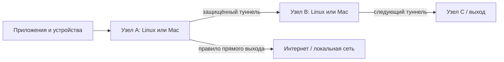

# Архитектура узлов

Каждый узел имеет свою политику, входы и выходы. Узел можно поставить рядом с
приложениями, использовать как системный/LAN-шлюз либо как следующий переход
цепочки. Общий Linux-сервер не является обязательным центром.

1. `src/policy.py`, `candidate_config.py`: правила и воспроизводимая native-конфигурация.
2. `src/web.py`, templates/static: непривилегированный GUI, черновик и подтверждаемое применение.
3. `tools/local_node.py`: локальный core/supervisor, owner-only control socket и независимый от GUI возврат.
4. `tools/mac_gateway.py`: отдельный защищённый Darwin IPv4 gateway с root receipt,
   собственными маршрутами, scopedPF, DNS/forwarding snapshot и launchd watchdog.
5. `src/safe_apply.py`, recovery modules и `install/`: Linux/systemd backend,
   privileged coordinator, защищённый rescue и проверяемая установка.

[Полная статическая карта файлов](code-map.svg) · [Файлы/строки/SHA и все отношения](code-map.json) · [Graphify symbols](graphify-code.json).
Карта строится из публичного source, install и tools. Semantic document extraction
не выполнялась. EXTRACTED/AMBIGUOUS различаются; статические отношения не являются
доказательством runtime behavior. Graphify сворачивает параллельные связи между
одинаковыми endpoints, полный file graph сохраняет отдельные line-bound отношения.
Пути относительные; приватные состояния и topology snapshots не входят в карту.
