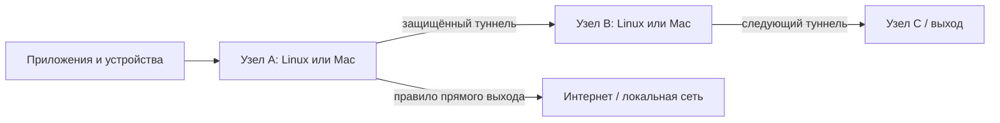

# Архитектура узлов

Каждый узел имеет свою политику, входы и выходы. Узел можно поставить рядом с
приложениями, использовать как системный/LAN-шлюз либо как следующий переход
цепочки. Общий Linux-сервер не является обязательным центром.

1. `src/policy.py`, `candidate_config.py`: правила и воспроизводимая native-конфигурация.
2. `src/web.py`, templates/static: непривилегированный GUI, черновик и подтверждаемое применение.
3. `tools/local_node.py`: локальный core/supervisor, owner-only control socket и независимый от GUI возврат.
4. `tools/mac_gateway.py`: отдельный защищённый Darwin IPv4 gateway с root receipt,
   собственными маршрутами, scopedPF, DNS/forwarding snapshot и launchd watchdog.
5. `src/safe_apply.py`, recovery modules и `install/`: Linux/systemd backend,
   privileged coordinator, защищённый rescue и проверяемая установка.

## Навигация по исходникам

[Карта файлов](code-map.svg) · [Связи с файлами, строками и SHA](code-map.json) ·
[Символы Graphify](graphify-code.json).

Карта охватывает публичные `src/`, `install/` и `tools/`. Это статический снимок:
он помогает искать определения и зависимости, но выполнение, права и поведение
при отказе проверяются по текущему коду и тестам. После изменения исходников
номера строк и хеши карты могут устареть.

Правила разработки и проверки: [CONTRIBUTING.md](../CONTRIBUTING.md).
