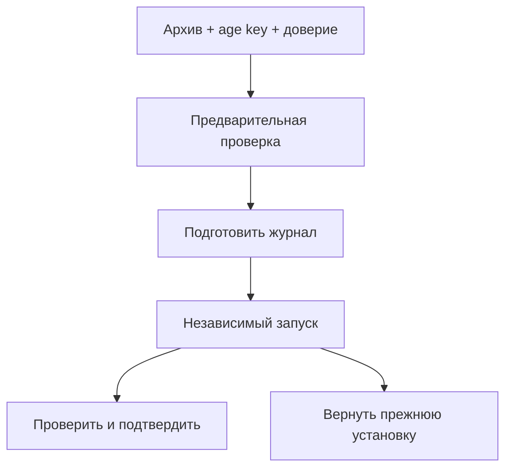

# Перенос настроек, резервные копии и восстановление

Этот раздел нужен до рискованного изменения и на случай потери машины.
Есть два разных результата: файл настроек для переноса правил и зашифрованная
копия установки для восстановления серверных файлов и служб.

| Задача | Что выбрать | Что переносится |
|---|---|---|
| Перенести правила на другой узел | JSON политики | Сохранённый черновик; без полной серверной установки |
| Вернуть установку после сбоя | Системная копия `.tar.gz.age` | Состав, перечисленный в карточке копии, включая секреты и службы |
| Вернуть ещё не подтверждённое изменение | Кнопка возврата в «Изменениях» | Прежний пакет этой операции; архив не нужен |

Системная копия рассчитана на полный Linux-узел с установленным механизмом
восстановления. Для локального Mac этот раздел не обещает полную копию ОС.
Сначала сохраните материалы ниже: один скачанный архив без ключа расшифровки
может оказаться бесполезен.

## Что нужно сохранить заранее

Три разных файла хранятся отдельно от сервера:

1. **Архив `.tar.gz.age`** — зашифрованная копия. Получается кнопкой создания и скачивания.
2. **Закрытый ключ age** — позволяет расшифровать именно ваш архив. Он создаётся
   при подготовке Linux-установки, а не при скачивании архива.
3. **Публичная идентичность восстановления** — позволяет проверить подпись старого
   сервера. Это JSON, а не пароль и не закрытый ключ.

На сервере, установленном по [Linux-инструкции](linux.md), ключ находится в
`/var/lib/okopy-backup/recovery.agekey`. Подготовительная копия до её ручной уборки —
`/var/lib/farvater-setup/private/var/lib/okopy-backup/recovery.agekey`.
Слово `okopy` в путях — сохранённое системное имя компонентов этой установки.

Чтобы получить закрытую копию под своим административным пользователем,
на **Linux-сервере** выполните:

```sh
sudo install -m 0600 -o "$(id -u)" \
  /var/lib/okopy-backup/recovery.agekey "$HOME/farvater-recovery.agekey"
```

Скачайте полученный `farvater-recovery.agekey` на отдельное устройство через
защищённый файловый доступ к своей учётной записи (SFTP/SCP). Не выводите ключ
в публичный журнал. При работе прямо на сервере скопируйте его на своё защищённое
внешнее хранилище с правами только владельцу.

В разделе «Резервные копии» нажмите **«Скачать публичную идентичность восстановления»**:
получится `farvater-recovery-identity.json`. Если кнопки или механизма нет,
установка ещё не готова к такому восстановлению — проверьте Linux-установку.
Публичный JSON можно проверить обычным текстовым редактором: в нём есть
`signing_fingerprint`, `host_id` и `scope`, но нет закрытого age key.

После создания первого архива выполните его предварительную проверку в панели
с **сохранённой внешней копией** age key. Нужен результат «Проверка завершена».
Так проверяется, что файл пригоден для расшифровки этого архива. Сверьте отпечаток
подписи в публичном JSON с показанным панелью. Храните проверенный JSON отдельно
от архива. До такой проверки не убирайте подготовительную копию ключа.
Это всё ещё не испытание полного восстановления файлов.



Схема полного восстановления Linux; JSON политики имеет отдельный порядок ниже.

## Перенести только политику

1. В резервных копиях откройте «Импорт и экспорт правил, DNS и выходов».
2. Скачайте JSON сохранённого черновика. Он содержит секреты подключений.
3. На другой установке выберите файл (до 2 МиБ) → «Проверить файл».
4. Просмотрите количество правил/DNS/выходов, предупреждения, интерфейсы
   и ссылки на отдельные службы VPN.
5. Подтвердите замену **всего черновика**. Предпросмотр действует 15 минут;
   при изменении черновика или истечении срока загрузите файл повторно.
6. Проверьте настройки на принимающем узле, отдельно примените и подтвердите.

JSON включает правила, DNS, выходы, резерв, AdGuard и входы; учётная запись панели,
отдельные VPN-службы и клиентские ключи этим переносом не заменяются.
Импорт до подтверждения не заменяет черновик, а после подтверждения ещё не меняет сеть.
Для отмены применённого неподтверждённого пакета используйте возврат; для возврата
черновика заранее сохраните его экспорт. Импорт не является слиянием двух политик.

## Создать и скачать системную копию Linux

Нужны настроенный backend копирования, age-получатель и ключ подписи установки.
Откройте состав и исключения копии: архив не является образом всего диска.

1. Сохраните age recovery key отдельно от сервера и архива.
2. Скачайте публичную идентичность восстановления и храните отдельно.
3. Завершите неподтверждённые изменения сети: во время них создание блокируется.
4. Нажмите «Создать зашифрованную копию», дождитесь готовности.
5. Скачайте `.tar.gz.age`, сохраните показанную SHA-256 и проверьте наличие файла
   на отдельном устройстве.

В панели до пяти операций. Удаление серверной записи не удаляет скачанный файл
и не меняет рабочую сеть. Если операция прервалась, сначала обновите список.
Закрытый ключ age не включается в создаваемый архив.

## Проверить архив

1. Загрузите подписанный зашифрованный архив (до 384 МиБ) и прежний age key.
2. На той же установке оставьте ID доверенной идентичности пустым. На чистом хосте
   администратор сначала устанавливает отдельно сохранённую доверенную идентичность;
   форма выбирает только её ID. Сам архив не задаёт себе доверие.
3. Выполните проверку. Посмотрите подпись, расшифровку, изменённые/отсутствующие/
   неподдержанные пути и совместимость UID/GID.
4. При несовместимости устраните конкретную причину; не переходите к запуску.

Предварительная проверка не меняет рабочие файлы и не является восстановлением.
Старый tar без подписанного манифеста не принимается. Ключ age передаётся по
административному HTTPS и не сохраняется после проверки.

## Если старый сервер потерян: подготовить новую машину

На прежней работающей установке доверие уже известно и поле ID обычно пустое.
На новой машине её собственный ключ подписи другой: старую подпись нужно
разрешить явно, используя **заранее сохранённый** публичный JSON старой машины.
Брать доверенный ключ из восстанавливаемого архива нельзя.

1. Установите полный Фарватер на отдельный совместимый Linux-сервер по
   [инструкции установки](linux.md). Для первого восстановления используйте
   ту же архитектуру/совместимый состав. Введите новые административные реквизиты.
2. Проверьте HTTPS основного и независимого входа. Сохраните новую учётную запись:
   она нужна независимой странице восстановления.
3. Приватно перенесите старый архив, старый age key и отдельно сохранённый публичный
   JSON. Проверьте происхождение JSON и сохранённый отпечаток. Старый age key нужен
   для старого архива; новый ключ новой установки его не заменяет.
4. На **новом Linux-сервере** установите доверенную идентичность командой ниже.
   Она создаёт одну запись доверия и не запускает восстановление.
5. Скопируйте напечатанный ID в поле доверенной идентичности при проверке архива.
6. После проверки разберите несовпадение владельцев/групп и неподдержанные пути.
   Готовность новой установки не гарантирует совместимость старой копии.

### Установить сохранённую публичную идентичность

Команда ниже — административный шаг для совместимой Linux-установки. Замените
путь первым аргументом на фактический файл `farvater-recovery-identity.json`.
Скрипт проверяет структуру/отпечаток, затем записывает только публичную идентичность
в защищённый каталог. Проверка соответствия отпечатка **своей сохранённой копии**
остаётся вашей: корректный чужой JSON не становится доверенным автоматически.

```sh
sudo /usr/bin/python3 -I - /absolute/private/farvater-recovery-identity.json <<'PYTHON'
import base64, hashlib, json, os, stat, sys, uuid
from pathlib import Path
source = Path(sys.argv[1])
raw = source.read_bytes()
if len(raw) > 4096:
    raise SystemExit("Public identity exceeds 4 KiB")
value = json.loads(raw)
required = {"version", "host_id", "scope", "signing_public_key", "signing_fingerprint"}
if set(value) != required | {"recipient"} or value["version"] != 1:
    raise SystemExit("Unsupported public identity export")
if any(not isinstance(value[k], str) or not value[k] for k in required - {"version"}):
    raise SystemExit("Invalid public identity fields")
key = base64.b64decode(value["signing_public_key"], validate=True)
if len(key) != 32 or hashlib.sha256(key).hexdigest() != value["signing_fingerprint"]:
    raise SystemExit("Public identity fingerprint mismatch")
folder = Path("/var/lib/okopy-recovery/anchors")
info = folder.lstat()
if folder.resolve() != folder or not stat.S_ISDIR(info.st_mode) or info.st_uid != 0 or info.st_mode & 0o077:
    raise SystemExit("Protected recovery anchor directory is not ready")
identifier = uuid.uuid4().hex
fd = os.open(folder / (identifier + ".json"), os.O_WRONLY | os.O_CREAT | os.O_EXCL | os.O_NOFOLLOW, 0o600)
with os.fdopen(fd, "w") as target:
    json.dump({k: value[k] for k in required}, target)
    target.flush()
    os.fsync(target.fileno())
print("Trusted identity ID:", identifier)
PYTHON
```

Если каталог не готов или проверка не прошла, исправьте указанную причину:
не расширяйте права защищённого каталога. Закрытый age key этой командой не
устанавливается и не публикуется; его выбирают отдельно в форме проверки архива.

После восстановления основная панель может использовать старую учётную запись
из снимка, а независимый вход сохраняет реквизиты новой установки. Подготовьте
обе пары до запуска; не ожидайте, что два входа автоматически используют один пароль.

## Подготовить, запустить, подтвердить или вернуть

Проводите первый опыт на отдельном стенде с физическим или независимым доступом.
Восстановление меняет файлы/службы и может остановить основную панель.

1. В карточке проверенного архива откройте восстановление. Если механизм,
   владельцы или состав не готовы, запуск недоступен.
2. Подтвердите подготовку: создаются журнал и загрузочная защита, рабочие файлы
   ещё не заменяются.
3. Откройте независимую страницу `/recovery/<ID операции>`, снова войдите
   через `/recovery/login` под сохранённой административной учётной записью.
4. Подтвердите временный запуск на независимой странице.
5. Читайте статус: подготовлено → замена файлов → запуск служб → ожидание подтверждения.
6. Проверьте службы, административный HTTPS, DNS, VPN и нужные клиентские маршруты.
   Подтвердите до срока, показанного статусом.
7. При ошибке выберите возврат прежней установки по той же операции. Независимый
   таймер и загрузочная защита также возвращают неподтверждённую операцию.

Независимый вход и access-check проверяют доступ управления, а не весь клиентский
трафик. При `unknown`, `recovery_required` или ошибке не создавайте второй запуск:
перечитайте статус, используйте независимый возврат и сохраните приватные журналы.
Закрытие браузера не отменяет таймер. Успешная проверка архива не подтверждает
работоспособность восстановленной установки; результат полноценной проверки
отмечается только после фактического испытания.

## Обновление, перенос машины и удаление

В этом выпуске Linux-установщик рассчитан на пустые пути: автоматического
обновления поверх существующей установки и универсального удаления нет.
Панель не предоставляет таких кнопок. Не используйте первую установку как upgrade.
Для переноса различайте JSON политики, системный архив и экспорт одного протокола;
проверяйте совместимость принимающей машины до восстановления.
Остановка ядра/панели и удаление файлов — разные действия. Сначала снимите
принадлежащие установке сетевые изменения и сохраните ключи/копии; удаление
служб и каталогов требует отдельного плана для фактической установки.
Mac LaunchAgent и остановка локального узла описаны в [сетапе](setup.md),
откат защищённого Mac-шлюза — в [его руководстве](macos-gateway.md).
