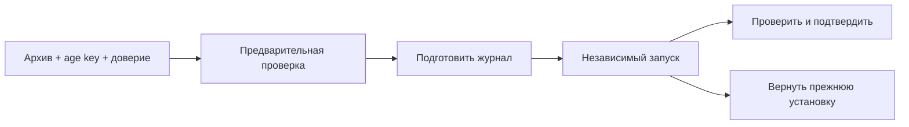

# Перенос настроек, резервные копии и восстановление

Схема полного восстановления Linux; JSON политики имеет отдельный порядок ниже.

## Перенести только политику

1. В резервных копиях откройте «Импорт и экспорт правил, DNS и выходов».
2. Скачайте JSON сохранённого черновика. Он содержит секреты подключений.
3. На другой установке выберите файл (до 2 МиБ) → «Проверить файл».
4. Просмотрите количество правил/DNS/выходов, предупреждения, интерфейсы
   и ссылки на отдельные службы VPN.
5. Подтвердите замену **всего черновика**. Предпросмотр действует 15 минут;
   при изменении черновика или истечении срока загрузите файл повторно.
6. Проверьте настройки на принимающем узле, отдельно примените и подтвердите.

JSON включает правила, DNS, выходы, резерв, AdGuard и входы; учётная запись панели,
отдельные VPN-службы и клиентские ключи этим переносом не заменяются.
Импорт до подтверждения не заменяет черновик, а после подтверждения ещё не меняет сеть.
Для отмены применённого неподтверждённого пакета используйте возврат; для возврата
черновика заранее сохраните его экспорт. Импорт не является слиянием двух политик.

## Создать и скачать системную копию Linux

Нужны настроенный backend копирования, age-получатель и ключ подписи установки.
Откройте состав и исключения копии: архив не является образом всего диска.

1. Сохраните age recovery key отдельно от сервера и архива.
2. Скачайте публичную идентичность восстановления и храните отдельно.
3. Завершите неподтверждённые изменения сети: во время них создание блокируется.
4. Нажмите «Создать зашифрованную копию», дождитесь готовности.
5. Скачайте `.tar.gz.age`, сохраните показанную SHA-256 и проверьте наличие файла
   на отдельном устройстве.

В панели до пяти операций. Удаление серверной записи не удаляет скачанный файл
и не меняет рабочую сеть. Если операция прервалась, сначала обновите список.
Закрытый ключ age не включается в создаваемый архив.

## Проверить архив

1. Загрузите подписанный зашифрованный архив (до 384 МиБ) и прежний age key.
2. На той же установке оставьте ID доверенной идентичности пустым. На чистом хосте
   администратор сначала устанавливает отдельно сохранённую доверенную идентичность;
   форма выбирает только её ID. Сам архив не задаёт себе доверие.
3. Выполните проверку. Посмотрите подпись, расшифровку, изменённые/отсутствующие/
   неподдержанные пути и совместимость UID/GID.
4. При несовместимости устраните конкретную причину; не переходите к запуску.

Предварительная проверка не меняет рабочие файлы и не является восстановлением.
Старый tar без подписанного манифеста не принимается. Ключ age передаётся по
административному HTTPS и не сохраняется после проверки.

## Подготовить, запустить, подтвердить или вернуть

Проводите первый опыт на отдельном стенде с физическим или независимым доступом.
Восстановление меняет файлы/службы и может остановить основную панель.

1. В карточке проверенного архива откройте восстановление. Если механизм,
   владельцы или состав не готовы, запуск недоступен.
2. Подтвердите подготовку: создаются журнал и загрузочная защита, рабочие файлы
   ещё не заменяются.
3. Откройте независимую страницу `/recovery/<ID операции>`, снова войдите
   через `/recovery/login` под сохранённой административной учётной записью.
4. Подтвердите временный запуск на независимой странице.
5. Читайте статус: подготовлено → замена файлов → запуск служб → ожидание подтверждения.
6. Проверьте службы, административный HTTPS, DNS, VPN и нужные клиентские маршруты.
   Подтвердите до срока, показанного статусом.
7. При ошибке выберите возврат прежней установки по той же операции. Независимый
   таймер и загрузочная защита также возвращают неподтверждённую операцию.

Независимый вход и access-check проверяют доступ управления, а не весь клиентский
трафик. При `unknown`, `recovery_required` или ошибке не создавайте второй запуск:
перечитайте статус, используйте независимый возврат и сохраните приватные журналы.
Закрытие браузера не отменяет таймер. Успешная проверка архива не подтверждает
работоспособность восстановленной установки; результат полноценной проверки
отмечается только после фактического испытания.

## Обновление, перенос машины и удаление

В этом выпуске Linux-установщик рассчитан на пустые пути: автоматического
обновления поверх существующей установки и универсального удаления нет.
Панель не предоставляет таких кнопок. Не используйте первую установку как upgrade.
Для переноса различайте JSON политики, системный архив и экспорт одного протокола;
проверяйте совместимость принимающей машины до восстановления.
Остановка ядра/панели и удаление файлов — разные действия. Сначала снимите
принадлежащие установке сетевые изменения и сохраните ключи/копии; удаление
служб и каталогов требует отдельного плана для фактической установки.
Mac LaunchAgent и остановка локального узла описаны в [сетапе](setup.md),
откат защищённого Mac-шлюза — в [его руководстве](macos-gateway.md).
