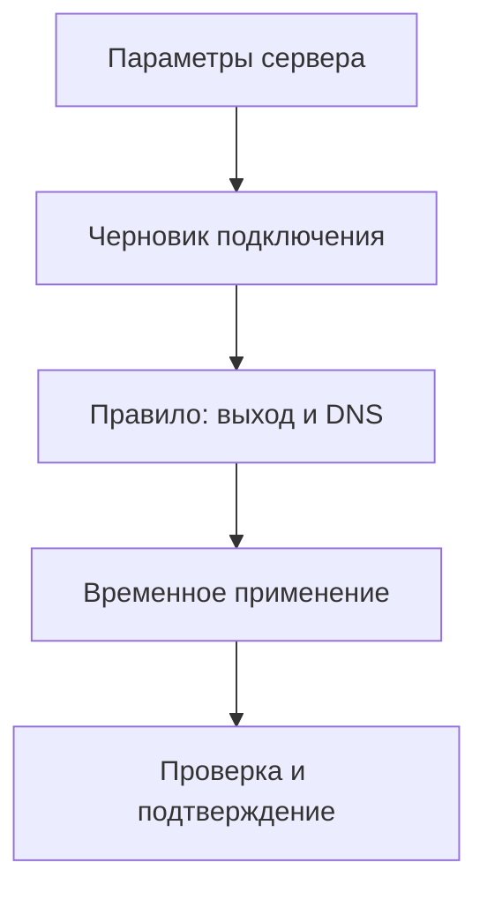

# Исходящие подключения и VPN-профили

«Подключения» — список путей, которыми узел может пользоваться: VPN, другой
узел цепочки, обычный прокси или прямой интернет. Этот раздел нужен, когда вам
выдали доступ к VPN либо вы хотите добавить собственную машину как следующий переход.
Он описывает, **куда отправлять** трафик; раздел устройств описывает, **откуда получать** его.

Например, вам прислали файл OpenVPN. Вы импортируете его здесь, затем в «Правилах»
выбираете, какие сайты должны использовать это подключение. Пока правила и вход
приложения не настроены, создание VPN не меняет маршрут браузера.

## Что именно вам выдали

| Материал | Куда идти | Что ещё потребуется |
|---|---|---|
| `.ovpn`, иногда CA/cert/key отдельно | OpenVPN внутри ядра | Адрес сервера и реквизиты из файла; недостающие файлы — у выдавшего доступ |
| `ss://` | Shadowsocks, импорт ссылки | Ссылка целиком; она содержит ключ |
| `vless://` | VLESS, импорт ссылки | Ссылка целиком, включая транспорт и TLS/Reality |
| TrustTunnel TOML или `tt://?` | TrustTunnel | Linux-служба клиента и выданные реквизиты |
| WireGuard `.conf` | Linux-профиль WireGuard | Адреса/ключи/peer из профиля; готовые системные инструменты WireGuard |
| AmneziaWG `.conf` | Linux-профиль AmneziaWG | Подготовленный движок AmneziaWG, совместимый с профилем |
| Корпоративный HTTPS-адрес, логин/пароль | Встроенный OpenConnect | Тип VPN и независимый DNS для адреса сервера |
| Уже существующая карточка службы OpenConnect | Отдельная служба OpenConnect | Настроенный адаптер этой службы |
| SOCKS/HTTP адрес и порт | SOCKS или HTTP CONNECT | Логин/пароль, если нужны |

Расширение `.conf` само по себе недостаточно: посмотрите название протокола
у отправителя. Серверный конфиг не заменяет клиентский профиль. При SSO/MFA
спросите администратора VPN, поддерживает ли он готовую сессию; обычная форма
пароля не выполняет интерактивный вход за вас.

## Готова ли ваша установка

Локальный режим, описанный в [сетапе](setup.md), запускает собственное ядро и
работает с его поддерживаемыми выходами. Для WireGuard/AmneziaWG и отдельного
TrustTunnel требуется полный Linux-узел. В карточке подключения должно читаться
состояние службы; ошибка «нет соединения с сервером управления» означает, что
сначала нужен [доступ к узлу](remote-access.md) или исправление его установки.

Проверка «Изменений» проверяет конфигурацию настоящим ядром. Если оно не поддерживает
выбранный тип, сохранённая форма не делает его доступным. Полный базовый Linux-комплект
содержит ядро и движки TrustTunnel. AmneziaWG/ocserv требуют отдельной проверенной
сборки по [серверной инструкции](linux.md); панель их не скачивает по нажатию.
Если такой сборки у вас нет, не переходите к запуску этого протокола: выберите
доступный вариант либо подготовьте компонент как администратор. Наличие формы
не является обещанием готового сервера любого протокола.



Схема настройки встроенного выхода; у отдельной VPN-службы собственная транзакция.

## Дополнительные компоненты: что можно подготовить самостоятельно

WireGuard использует системные `wg`/`wg-quick`. На выделенной Ubuntu 24.04
администратор может установить их: `sudo apt install wireguard-tools`, затем
проверить `wg --version`, `command -v wg-quick` и `systemctl cat wg-quick@.service`.
Создание профиля в панели ещё требует поддержки WireGuard ядром Linux, отсутствия
конфликтов и проверки прав управления. Это инструменты для Linux, не рецепт
для переносимого узла Mac.

AmneziaWG и входящий OpenConnect/ocserv в текущем публичном выпуске не имеют
готового пошагового скачивания/сборки из пользовательской панели. Нужны заранее
собранные проверяемые каталоги, которые передают Linux-сборщику. Если их нет,
эти ветки не являются готовым первым сетапом. Не заменяйте их произвольным архивом.

Для администратора, у которого такие каталоги **уже есть**, перед сборкой stage:

```sh
sudo /usr/bin/python3 install/build_current.py \
  --destination /var/lib/farvater-setup/stage \
  --amnezia-engine /absolute/verified/amneziawg \
  --ocserv-engine /absolute/verified/ocserv \
  --ocserv-package-version EXACT_PACKAGE_VERSION
```

Stage должен ещё не существовать. Можно передать только выбранный компонент.
Версию ocserv берут из manifest проверенной сборки; установка через `apt install ocserv`
сама по себе такой каталог не создаёт. AWG-комплект ожидает закреплённую сборку
`tools-3.1.20260812-go-b5928ef-amd64`, `awg`, `awg-quick`, `amneziawg-go` и лицензии.
Ocserv-комплект — Ubuntu 24.04 amd64 с манифестом версии и хешами файлов.
Если сборщик отклоняет manifest, выбранный комплект не подходит. После построения
продолжите обычные provision/check/apply в [Linux-инструкции](linux.md).

Встроенный исходящий OpenConnect не требует входящего ocserv. Для него используйте
соответствующую форму и выданные реквизиты, если она поддерживается вашим ядром.

## SOCKS, HTTP CONNECT, Shadowsocks и VLESS

1. «Подключения» → «Добавить подключение» → нужный протокол.
2. Задайте название, назначение, IP/имя и порт сервера.
3. Заполните параметры протокола из выданного вам подключения.
4. Для TLS задайте имя сертификата и нужные доверенные параметры; для транспортов
   задайте путь/Host или имя службы ровно как на сервере.
5. Сохраните черновик, выберите выход в правиле, примените и проверьте клиентский запрос.

| Протокол | Что подготовить |
|---|---|
| SOCKS | Адрес, порт, версия 5/4a/4, учётные данные при необходимости |
| HTTP CONNECT | Адрес, порт, учётные данные, TLS при наличии |
| Shadowsocks | Метод шифрования и пароль/ключ, адрес и порт |
| VLESS | UUID, flow, TLS/Reality и транспорт, соответствующие серверу |
| Прямой выход | Назначение; для рабочего выхода — существующий VPN-интерфейс |
| Группа выходов | Состав существующих выходов и параметры выбранной группы |

Дополнительные поля зависят от типа: используйте только параметры соответствующего
сервера. Пустое поле сохранённого секрета обычно сохраняет значение; удаление
выполняется отдельным флажком. Проверяйте подсказку конкретного поля.

## Импорт и экспорт встроенных подключений

VLESS можно импортировать из `vless://` или текстового файла; Shadowsocks — из
`ss://`. Импорт создаёт черновик: сначала проверьте адрес, секреты и транспорт.
Экспортируйте сохранённый VLESS/SS либо JSON sing-box из карточки подключения.
Файл содержит секреты; несохранённые поля формы не экспортируются.

Импорт JSON sing-box создаёт подключение из поддерживаемого фрагмента конфигурации.
Ссылки на DNS и другие выходы должны существовать в принимающей политике.
Не рассматривайте экспорт одного выхода как перенос всей установки.

Для удаления замените ссылки на выход в правилах/DNS/группах, затем используйте
подтверждаемое удаление записи и примените черновик. Для отмены незакреплённого
изменения верните прежний пакет в разделе изменений.

## OpenVPN внутри ядра

1. Выберите OpenVPN в добавлении подключения.
2. Импортируйте `.ovpn` либо заполните форму. Для внешних ссылок на сертификаты
   приложите соответствующие текстовые PEM-файлы: до 16 файлов с уникальными именами без пути.
3. Проверьте адреса серверов, транспорт, аутентификацию и сертификаты.
4. Сохраните, назначьте выход правилу, примените общую политику и проверьте VPN.

Профиль и каждый сопутствующий файл ограничены 128 КиБ. PKCS12 не поддерживается.
Сохранение не запускает VPN. Экспорт `.ovpn` относится к сохранённому черновику.
Для DNS, полученного от OpenVPN, создайте соответствующий DNS-профиль; разрешение
имени самого VPN должно использовать независимый DNS.

## OpenConnect / Cisco внутри ядра

Выберите протокол, HTTPS-адрес (допустим путь группы), тип сервера, независимый
DNS для его имени, логин/пароль либо cookie готовой сессии. Настройки совместимости
(DTLS/UDP, IPv6, MTU, интервалы, User-Agent) согласуйте с сервером.
Импорт поддерживает `.conf`, Cisco XML и ZIP, экспортированный панелью.
Сохраните черновик и примените общую политику. Этот клиент не меняет системные
маршруты сервера. Интерактивные SSO/MFA, клиентские сертификаты и проверки устройства
не закрываются обычной формой с паролем или cookie.

## Отдельная служба OpenConnect

Для уже зарегистрированного служебного подключения карточка управляет его собственным
черновиком и состоянием. Это другой механизм, чем встроенный OpenConnect ядра.

1. Сохраните параметры либо импортируйте `.conf`, XML или ZIP в черновик службы.
2. «Проверить» проверяет параметры без авторизации на VPN-сервере.
3. Укажите контрольный URL и допустимые коды. Примените параметры, проверьте
   переподключение и подтвердите до срока автоматического возврата.
4. Для запуска/остановки используйте отдельное действие и подтверждение.
5. Автозапуск включается/выключается отдельно; это не перезапускает и не останавливает
   текущее соединение.

Экспортируйте выбранный источник (рабочий файл/черновик) по форме карточки.
«Отбросить черновик» перечитывает рабочие настройки. При ошибке операции обновите
статус и выполните возврат в карточке, а не повторяйте действие вслепую.

## TrustTunnel

1. Добавьте TrustTunnel через форму, TOML или ссылку подключения.
2. Укажите название, назначение и параметры сервера/учётной записи.
3. Подключение создаётся **выключенным, без автозапуска**. Если создание на сервере
   прошло, а запись панели не сохранилась, перечитайте каталог и завершите добавление
   сохранённого подключения вместо создания дубликата.
4. Проверьте параметры, задайте контрольный URL и запустите временно.
5. Проверьте трафик и подтвердите; затем назначьте выход в общем правиле и отдельно
   примените правила.

Сохранение, импорт и удаление черновика не меняют работающую службу. Проверка
параметров не выполняет вход на VPN-сервер. Применение выключенного подключения
может сохранить параметры, оставив его выключенным — это не проверка связи.
Запуск/остановка подтверждаются отдельно. Автозапуск клиента и связанных входящих
служб переключается без текущего перезапуска. При ошибке используйте возврат
и перечитайте состояния связанных служб. Экспорт TOML/ссылки содержит секреты.

## WireGuard и AmneziaWG как Linux-службы

1. Создайте профиль из формы (AmneziaWG также из `.conf`). Подготовьте адреса
   интерфейса, ключи, peer endpoint, AllowedIPs и другие параметры своего сервера.
2. Новый профиль выключен. Сохраните или импортируйте настройки в черновик профиля.
3. Проверьте файл, при применении задайте доступный контрольный TCP-адрес/порт,
   если это требуется выбранным действием.
4. Примените временно, проверьте связь и подтвердите в карточке. При проблеме
   верните прежний файл и состояние.
5. Запуск/остановка временные и требуют подтверждения. Автозапуск меняется отдельно
   и не меняет текущее соединение.

Для AmneziaWG создание добавляет выход и DNS в общий черновик; существующий исправный
профиль можно зарегистрировать в политике из карточки. После проверки туннеля
назначьте его нужному правилу и примените общую политику.
Обычный профиль WireGuard и выбор его для общего маршрута — разные настройки.

Импорт `.conf` ограничен 256 КиБ. Экспорт выбирает рабочий файл или черновик.
«Отбросить» удаляет черновик профиля. Действие закрытия проверки без восстановления
не возвращает файл и соединение: применяйте его только после разбора состояния,
следуя описанию карточки. После перезагрузки перечитайте статус: восстановленный
файл не доказывает запуск туннеля. Успешная TCP-проверка не доказывает доступность
всех удалённых сетей, DNS и UDP.

## Проверка результата

Для каждого выхода проверяйте отдельно доступность сервера, аутентификацию,
DNS, TCP и нужный UDP. Затем проверьте правило через вход Фарватера, а не только
порт следующего узла. Секретные файлы и ссылки храните приватно.

## Параметры WireGuard и AmneziaWG

| Поле | Как выбрать |
|---|---|
| Имя профиля WG | Свободное имя до 15 латинских букв/цифр и `_.-` |
| Адрес интерфейса | Выданный другой стороной IP с префиксом; не адрес VPN-сервера |
| Закрытый ключ | Выданный ключ либо пусто для генерации нового при создании; передать другой стороне открытый ключ |
| Порт и MTU | Оставить автоматический выбор либо согласованные значения |
| Таблица | `auto` — wg-quick, `off` — отдельные маршруты, число — своя таблица |
| Peer PublicKey | Открытый ключ другой стороны |
| AllowedIPs | Сети, доступные через этого пира; общий маршрут требует отдельной политики |
| Endpoint | Доступные адрес и порт другой стороны |
| PSK, keepalive | Значения, согласованные с другой стороной |

Пиров можно добавить после создания профиля. Для AmneziaWG перенесите параметры
`Jc/Jmin/Jmax`, `S1–S4`, `H1–H4`, `I1–I5` из выданного профиля. Настройки AWG 3.1
(защита заголовков, padding, времена rekey, cookies) также должны совпадать со
стороной сервера. При защите заголовков S1–S4 не меньше 12; ключ — 32 байта Base64.
При создании DNS из файла добавляется в общий список, но последующая правка DNS
в файле автоматически не переписывает DNS-профиль панели.

## Очередь выходов

Создайте необходимые выходы, затем выберите «Группа выходов»/ручную очередь,
задайте её состав из существующих выходов. Назначьте группу правилу и примените.
Проверяйте зависимости и отсутствие циклов. Группа сама по себе не заменяет
измерения всех резервных пар и настройку автоматики.

## Ошибки и ограничения импорта

Ссылку и файл `ss://` или `vless://` выбирайте по одному, не одновременно;
текстовый файл UTF-8 до 64 КиБ должен содержать одну ссылку. TrustTunnel TOML
и OpenConnect ограничены 128 КиБ. Неизвестные параметры и недостающие связи
исправляйте по сообщению проверки, сохраняя оригинал приватно.
Если для прежнего внешнего подключения редактор недоступен, используйте его
карточку службы/профиля: общий редактор не переносит такие настройки автоматически.

## TLS, Reality и транспорт

В TLS укажите SNI, при необходимости минимальную/максимальную версию, ALPN и
uTLS-отпечаток из параметров сервера. Новый CA заменяет сохранённый; пустое поле
сохраняет его, отдельный флажок удаляет. Системное хранилище используется без своего CA.
Отключение проверки сертификата снижает защиту: исправляйте доверие, имя или сертификат
сервера вместо использования этого переключателя как обычного решения ошибки.

Для Reality перенесите параметры выданного подключения. Vision требует TLS и
обычный TCP; QUIC использует обычный TLS без Reality/uTLS. XHTTP не поддерживается
этими формами. Выберите transport и соответствующие путь/Host, HTTP-метод,
early data, имя gRPC. WebSocket/HTTPUpgrade допускают один Host, HTTP — несколько.
Новые заголовки JSON заменяют сохранённый набор целиком; пустое поле сохраняет,
флажок удаляет. Кодирование UDP (XUDP/packetaddr/без кодирования) согласуйте с сервером.

У очереди выходы задаются **идентификаторами**, показанными в списке, по одному
на строку. Начальный выход должен входить в очередь. Флажок закрытия старых
соединений меняет поведение при переключении; проверьте его на тестовом приложении.

У TrustTunnel hostname задаёт имя TLS и может отличаться от адресов `сервер:порт`;
IPv6 вводится как `[адрес]:порт`. Пароль и дополнительные секреты изменяются через
действие поля; DNS внутри VPN, killswitch и журнал настраиваются отдельно.
Полный TOML должен использовать локальный SOCKS: TUN, пользовательские исключения
и неизвестные поля не импортируются. Локальный порт назначает сервер.

Для OpenVPN несколько серверов вводятся отдельными строками `host port transport`.
Поля фильтров маршрутов сохраняют кавычки и пробелы. Параметры экспорта `nobind`,
`persist-key`, `persist-tun`, `auth-nocache`, `resolv-retry` и уровень журнала
относятся к самостоятельному OpenVPN-клиенту; жизненным циклом встроенного клиента
управляет общее ядро.
