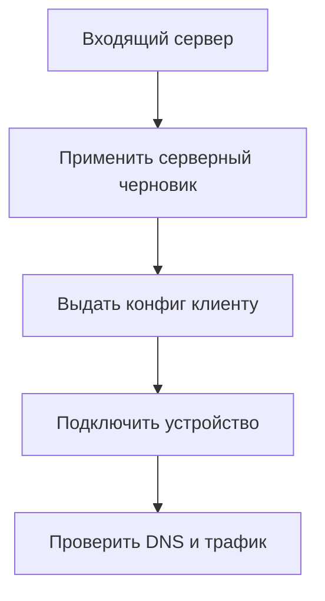

# Устройства, входящие серверы и LAN

Этот раздел нужен, чтобы другие приложения и устройства могли пользоваться
вашим узлом. Например, телефон подключается к домашнему серверу по VPN,
а приложение соседнего компьютера — к его прокси.

Здесь создаются **входящие** подключения: узел принимает клиента.
В «Подключениях» создаются **исходящие**: узел сам соединяется со следующим сервером.
Это две стороны цепочки, и одна не появляется автоматически при создании другой.

## Выберите свою задачу

1. **Отдельное приложение на этом компьютере.** Достаточно [локального прокси](setup.md#4-проверьте-трафик-и-подключите-приложение).
2. **Приложение на соседней машине в домашней сети.** Используйте [LAN SOCKS](setup.md#6-подключите-приложение-на-другой-машине-lan).
3. **Телефон должен подключаться по VPN.** Нужен полный Linux-узел и входящий
   VPN-сервер. Если его ещё нет, начните с [примера OpenVPN для телефона](phone-vpn.md).
4. **Уже есть сервер WireGuard или TrustTunnel.** Используйте его страницу клиентов ниже.
5. **Вся сеть должна проходить через сервер.** Это отдельная настройка LAN/WG-входа
   и сетевого маршрута; выдача одного клиентского конфига не настраивает роутер.

**Клиент** — телефон/компьютер и его персональное подключение. **Конфиг** — файл
с адресом сервера и ключами, который импортируется в приложение клиента.
**Endpoint** — адрес и порт, по которым клиент достигает сервера.
Допуск IP, выдача ключа и запуск слушающего порта — разные настройки.

Схема выдачи нового входящего подключения; изменение уже работающих клиентов
отдельной службы может действовать сразу и переподключать их.

## Клиенты WireGuard

Нужен настроенный Linux VPN-сервер и доступный backend управления клиентами.

1. На странице клиентов укажите локальный и внешний endpoint для выдачи конфигов.
   Сохранение этих адресов не меняет уже подключённые устройства.
2. Добавьте клиента: имя, DNS, маршруты, MTU, keepalive, IPv6 при необходимости.
3. Скачайте `.conf` или QR в карточке для локального/внешнего режима подключения.
4. Импортируйте конфиг в клиентское приложение, включите туннель и проверьте
   handshake, DNS и доступ по выданным маршрутам.

Переименование меняет только название. Отключение требует подтверждения и сохраняет
ключи; после повторного включения подходит прежний конфиг. Если связь не возвращается,
переключите WireGuard на клиенте. Импорт клиентского `.conf` (UTF-8, до 256 КиБ)
сохраняет проверенный конфиг для выдачи, а не меняет текущее соединение.
Если операция не завершена, перечитайте статус и используйте завершение операции
по карточке. При недоступном QR скачайте конфиг; серверу требуется `qrencode`.
Конфиг и QR содержат закрытый ключ, их нельзя публиковать.

## Клиенты TrustTunnel

1. Откройте устройства TrustTunnel и нужный endpoint.
2. Задайте локальный/внешний адрес и DNS для следующих выдач подключения.
3. Создайте или измените клиента: логин, пароль, лимиты HTTP/2 и HTTP/3.
4. Подтвердите краткое переподключение клиентов этого сервера при сохранении,
   удалении или импорте учётных данных.
5. Выдайте TOML, ссылку, QR либо файл учётных данных, выбрав локальный/внешний режим.
6. Подключите клиент и проверьте DNS и трафик.

Удаление клиента прекращает его доступ, а смена адресов выдачи не переписывает
старые клиентские конфиги. При незавершённой операции используйте восстановление
прежнего списка по карточке и снова проверьте endpoint. QR требует `qrencode`;
при отказе используйте ссылку или TOML. Все форматы выдачи приватные.

## Входящий сервер внутри политики

1. Откройте входящие подключения → новый вход → нужный протокол.
2. Укажите название, listener IP/порт и адреса для локальной и внешней выдачи.
   `127.0.0.1` доступен только этому серверу; `0.0.0.0` слушает все IPv4-интерфейсы.
3. Заполните протокольные параметры и клиентов; сначала проверьте их в черновике.
4. Включите вход, сохраните и примените общую политику.
5. Только после применения выдайте клиенту сохранённый конфиг и проверьте подключение.

| Протокол | Что подготовить / формат выдачи |
|---|---|
| SOCKS / HTTP | Пользователь/пароль; клиентский JSON; для HTTP TLS при необходимости |
| Shadowsocks | Метод, серверный ключ, TCP/UDP; отдельные пользователи для SS2022 AES; JSON/ссылка/QR |
| VLESS | UUID/flow клиентов, TLS, транспорт и его параметры; JSON/ссылка/QR |
| OpenVPN | Параметры сервера, сертификаты и клиенты; JSON/`.ovpn` |
| AmneziaWG | Интерфейс, ключи, маскирующие параметры, peer-клиенты; серверный/клиентский `.conf`, QR |
| OpenConnect / AnyConnect | ocserv-движок, TLS и клиентские параметры; архив сервера/клиента |

Для внешнего доступа отдельно настройте firewall и перенаправление порта на роутере.
Панель не подтверждает доступность интернета наличием listener. Выбирайте адреса
без схемы и порта; TLS и транспорт клиента должны совпадать с сервером.

Добавление, отключение и удаление строк клиентов меняют черновик входа. Для отключения
действующего клиента примените пакет. При удалении входа подтвердите действие,
примените и проверьте закрытие порта. Импорт серверного конфига допускает тот же
протокол; для другого создайте отдельный вход. AmneziaWG поддерживает отдельный
импорт клиентского `.conf`. Экспорт сервера/клиента использует сохранённый черновик,
поэтому он может отличаться от действующей сети. Когда все клиенты отключены,
перенос полного состояния выполняйте системной копией, а не пустым серверным экспортом.

## LAN DNS/прокси и прозрачные назначения Linux

1. Откройте LAN-вход. Укажите фактический IP сервера, сетевой интерфейс,
   допущенные клиентские IPv4 `/32`.
2. Для явного прокси/DNS оставьте прозрачные назначения пустыми.
   SOCKS/HTTP использует порт 15458, DNS — 15454.
3. Если нужен обратный путь через шлюз, включите его и укажите фактический LAN-шлюз.
4. Для прозрачного перехвата задайте сети **назначения**, исключив управление.
   Маршрут клиента/роутера должен реально вести этот трафик через сервер.
5. Сохраните, примените, проверьте DNS и трафик с каждого допущенного клиента,
   затем подтвердите.

Допуск по IP предназначен для доверенной сети. Поле устройства не означает адрес
сайта. Имена для проверок со шлюза задаются отдельно.
**Выключенный вход блокирует выбранные прозрачные назначения.** Для полного снятия
перехвата очистите их список и примените выключенный вход. Простой флажок выключения
не является инструкцией вернуть прямой трафик.

## Вход из WireGuard Linux

1. Создайте клиентские ключи отдельно и проверьте существующий интерфейс.
2. Укажите интерфейс WG, IPv4 `/32` или сеть источников и сети обхода управления.
3. Для IPv6 задайте источники `/64–/128` и отдельные сети обхода.
4. Решите, обслуживать ли все DNS-запросы клиентов по общей политике до обхода.
5. Включите вход, сохраните, примените и проверьте с реального WG-клиента IPv4,
   IPv6 при наличии, DNS и доступ управления.

Допуск адреса не создаёт ключ. При выключении область перехвата блокируется.
Для полного удаления очистите источники и примените выключенный вход.
Системный шлюз Mac использует [другой механизм](macos-gateway.md).

## Сетевые параметры входящих VPN

Для OpenVPN выберите UDP/TCP, свободный адрес сервера с пулом и непересекающимся
префиксом, MTU и лимит подключений. Укажите PEM сертификат/ключ сервера и клиентов
с индивидуальным логином/паролем. Опция нескольких подключений с одними реквизитами
выбирается отдельно. Выданный `.ovpn` проверяет отпечаток сертификата сервера.

Для AmneziaWG задайте UDP-порт, свободный серверный адрес/пул, клиентские DNS,
маршруты и MTU. Пустые параметры маскировки при создании получают начальные значения;
они включаются в клиентские конфиги. У клиента можно задать адрес, сети за ним,
открытый/закрытый ключ и PSK. С одним открытым ключом можно принять клиента,
но для выдачи полного клиентского конфига нужен его закрытый ключ и адрес.
Пул не должен пересекаться с вашей LAN или другим VPN.

Для ocserv / AnyConnect задайте TCP-порт и DTLS/UDP при необходимости,
свободные пулы, DNS клиентов, маршруты, split-DNS, сертификат и закрытый ключ.
За роутером перенаправляйте TCP и, при DTLS, UDP того же порта. MTU, число клиентов,
keepalive/DPD выбирайте по внешнему пути; для IPv6 форма требует MTU не меньше 1400.
При импорте только хеша пароля старый пароль продолжает работать, но для выдачи
клиентского ZIP задайте новый пароль. Серверный ZIP содержит `ocserv.conf`,
сертификат, ключ и `ocpasswd` в корне; внешние скрипты не импортируются.

Для VLESS flow Vision используйте TLS без WebSocket. Транспорт TCP/WebSocket/HTTP/
HTTPUpgrade/gRPC, пути и Host должны совпадать с клиентом. Для Shadowsocks 2022 AES
можно выдать отдельные учётные записи на одном порту; у других шифров общий пароль.
Проверяйте TCP и UDP отдельно, если сервер обслуживает оба транспорта.
