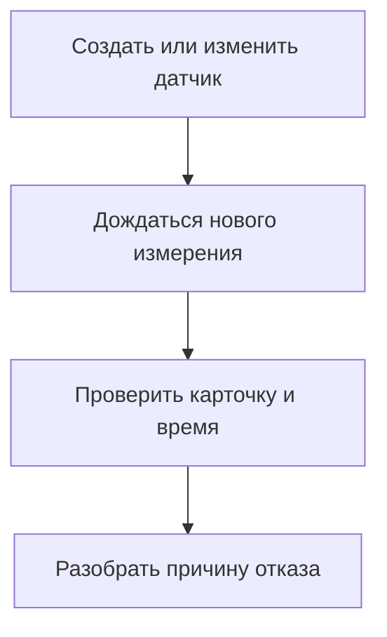

# Мониторинг и удалённый доступ

Схема мониторинга: изменение датчика не требует применения сетевого черновика.

## Прочитать состояние

Откройте «Обзор», затем «Мониторинг». Сравните время снимка с текущим временем,
прочитайте источник и ошибки транспорта. Устаревший снимок показывает прошлое,
а отсутствие метаданных не подтверждает состояние службы.
Откройте проблемную карточку и выполните указанную проверку с нужного узла.
Успех TCP-порта не доказывает работу DNS, VPN-аутентификации или UDP.

## Создать, изменить или удалить датчик

Нужен backend мониторинга. Откройте управление датчиками → «Добавить датчик».
Выберите тип, название, группу, подсказку действий при отказе, период и параметры.

| Тип | Что заполнить и что измеряется |
|---|---|
| DNS | IP/порт сервера, имя, TCP или UDP, таймаут: ответ выбранного DNS |
| HTTP(S) | URL, необязательный SOCKS IP:порт, коды, таймауты; внешний IPv4 — только если тело ответа содержит его |
| HTTP(S), медленная сеть | Те же параметры, увеличенное ожидание; период не менее 60 секунд |
| TCP | IP, порт, таймаут: соединение к порту |
| ICMP | IP и таймаут: ответ ICMP, который сеть может блокировать |
| UDP STUN | STUN host/порт, SOCKS и таймаут: UDP-путь через выбранный прокси |
| systemd | Имя уже существующей службы |

Сохранение действует со следующего измерения без общего применения сетевого
черновика. Дождитесь нового результата. Для собственного датчика можно изменить
тип и удалить его с подтверждением; старые события остаются в истории.
Тип системного датчика неизменяемый, удаление ему недоступно. Изменяемые пороги
ресурсов и параметры специальных проверок задавайте в их карточках.
Если форма устарела, обновите её перед сохранением.

## Организовать дашборд

В управлении датчиками перетащите карточки или используйте кнопки вверх/вниз.
Флажок «На дашборде» управляет видимостью. Нажмите «Сохранить дашборд» и откройте
мониторинг. Скрытые датчики продолжают измерения и участвуют в общем состоянии.
Скрытие красной карточки не устраняет отказ и не отключает её проверку.

## История переключений

Откройте журнал переключений, выберите нужную очередь. Сопоставьте причину,
время и выбранную пару с [настройками резервирования](panel-rules-dns.md).
Ручное закрепление и включение автоматики относятся к активному состоянию,
а пороги/проверки пар — к применяемому черновику.

## Панель через SSH

1. Запустите `tools/run_panel.py --mode remote` по [инструкции](macos.md).
2. Откройте `/server/access`, укажите адреса Linux-сервера, порты, пользователя,
   ключ/SSH-agent и необходимые параметры sudo.
3. Ключ хоста должен быть проверен и доверен заранее; неизвестный или изменившийся
   ключ не принимается автоматически.
4. Сохраните доступ. Следующие команды используют новые адреса; сеть сервера
   от сохранения формы не меняется.
5. Проверьте актуальный мониторинг и чтение статуса ядра прежде, чем изменять сеть.

В локальном режиме SSH-настройки не используются. Ошибку доступа исправляйте по
сообщению, сохраняя проверку ключа. После неоднозначного ответа меняющей команды
сначала перечитайте состояние. Секреты доступа хранятся в приватном состоянии панели.

## Роутеры

В публичном выпуске есть шаблоны интеграции роутеров, но их обработчики не
зарегистрированы в `create_app`. Добавление роутера и отдельное управление аварийным
IPv6 через такие шаблоны не являются доступными сценариями этого выпуска.
Маршруты на внешнем роутере настраиваются отдельно; документация не обещает
установить службы роутера флажком панели.
