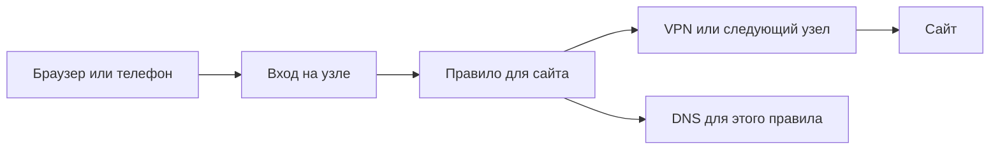

# Как устроен Фарватер

Фарватер нужен, когда вы хотите сами выбирать путь сетевого трафика: например,
одни сайты открывать через VPN, домашние устройства — напрямую, а при отказе
одного подключения переходить на другое. Панель позволяет собрать эти настройки
в одном месте, проверить их и вернуть прежние, если связь после изменения пропала.

## Панель и узел — разные вещи

**Узел** — компьютер, на котором Фарватер обрабатывает трафик: Mac mini,
Linux-сервер или другая поддерживаемая машина. **Панель** — веб-интерфейс,
в котором вы задаёте настройки. Обработка трафика выполняется отдельным процессом —
сетевым ядром. Закрытие вкладки браузера не останавливает работающий узел.

Панель может управлять узлом на том же компьютере или установленным Linux-узлом
на другой машине. Несколько узлов могут образовывать цепочку; центральный сервер
для всех машин не обязателен.

## Один запрос: от приложения до сайта

Представьте, что браузер должен открыть `example.com` через ваш VPN.

1. Вы подключаете браузер к **входу** узла — например, задаёте ему SOCKS-прокси.
   В режиме шлюза трафик попадает на узел по сетевому маршруту.
2. Узел сопоставляет запрос с **правилами**. Правило может учитывать сайт,
   адрес устройства, протокол и другие условия.
3. Совпавшее правило выбирает **подключение**, через которое отправится трафик:
   VPN, следующий узел или прямой выход.
4. **DNS-профиль** определяет, как узнать IP-адрес сайта по его имени.
   Для публичного сайта и внутреннего рабочего имени могут понадобиться разные DNS.
5. **Мониторинг** проверяет выбранные условия работы; при настроенном резервировании
   отдельный механизм выбора может переключать подходящие пары выхода и DNS.

Новое VPN-подключение не меняет путь браузера само по себе. Нужно также направить
браузер на вход узла и выбрать VPN в подходящем правиле. Именно поэтому в панели
есть отдельные разделы «Подключения», «Устройства» и «Правила».

## Что делает каждый раздел

| Раздел | На какой вопрос отвечает |
|---|---|
| Обзор | Что сейчас происходит с установкой и есть ли проблемы? |
| Мониторинг | Какая проверка не прошла, когда это случилось и что проверить дальше? |
| Подключения | Куда узел может отправлять трафик? |
| Правила | Какие сайты и устройства должны использовать какой путь? |
| DNS и фильтрация | Кто разрешает имена сайтов и что следует блокировать? |
| Устройства | Как приложение, телефон или целая сеть попадают на узел? |
| Изменения | Как безопасно включить сохранённые настройки? |
| Резервные копии | Что сохранить на случай ошибки или потери машины? |
| Помощь | Как найти инструкцию и разобраться с доступом? |

## Какой вариант установки нужен вам

1. **Хочу познакомиться или направить отдельное приложение через прокси.**
   Начните с [локального узла](setup.md). Он работает от обычного пользователя;
   сеть всей машины от одного запуска не переключается.
2. **Хочу подключать телефоны по VPN и иметь сервер с восстановлением.**
   Нужен [полный Linux-узел](linux.md), затем входящий VPN-сервер и клиентские конфиги.
3. **Хочу направить весь трафик Mac и отдельной LAN через туннель.**
   Для этого есть [экспериментальный шлюз Mac](macos-gateway.md). Нужны отдельная
   машина, два интерфейса и проверка реального трафика. Обычный локальный запуск
   такой шлюз не включает.
4. **Сервер уже установлен, хочу управлять им с ноутбука.**
   Используйте [удалённую панель](remote-access.md).

В локальном режиме некоторые серверные функции недоступны. Это ограничение
режима, а не повод менять пароли или повторять установку. [Матрица совместимости](validation.md)
отделяет проверенные варианты от экспериментальных.

## Сохранение не равно применению

**Черновик** — настройки, которые вы подготовили в формах. **Действующая политика** —
настройки, которые сейчас использует ядро. Сохранение формы меняет черновик.
В «Изменениях» применяется весь черновик, а не только последняя открытая форма.

Применение временное: за указанное время проверьте нужный трафик и подтвердите
результат. Если не подтвердить, прежние настройки возвращаются. Это страховка
от потери доступа, но проверку своей сети всё равно выполняете вы.

Некоторые операции действуют сразу: управление клиентами отдельной VPN-службы,
активный выбор выхода и настройки датчиков. Соответствующая инструкция объясняет
их отдельно; не рассчитывайте, что любая кнопка только меняет черновик.

## С чего начать после входа

Сначала откройте «Обзор» и убедитесь, что панель видит узел. Затем выполните
один небольшой сценарий: [подключите приложение](setup.md#4-проверьте-трафик-и-подключите-приложение)
или [направьте один сайт через VPN](panel-rules-dns.md#пример-один-публичный-сайт-через-vpn).
После этого расширяйте правила. До рискованных изменений подготовьте
[материалы восстановления](panel-backups.md#что-нужно-сохранить-заранее).
