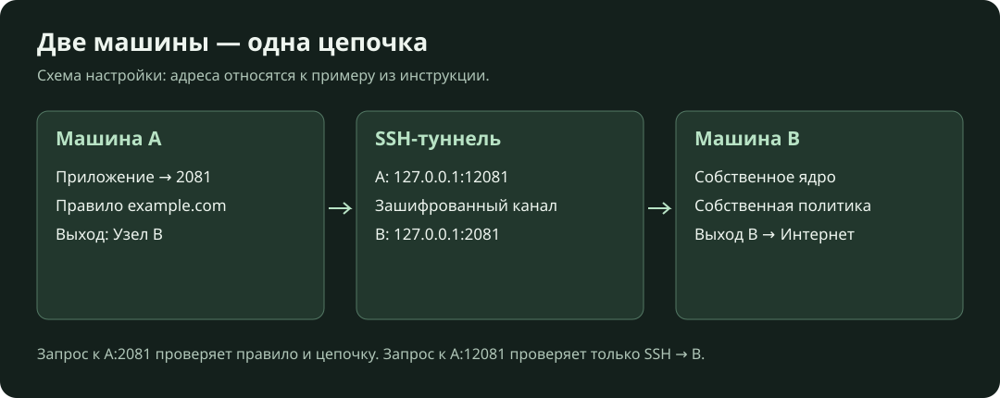
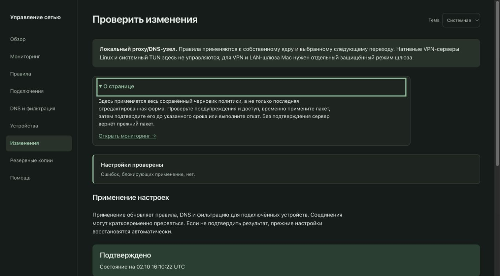
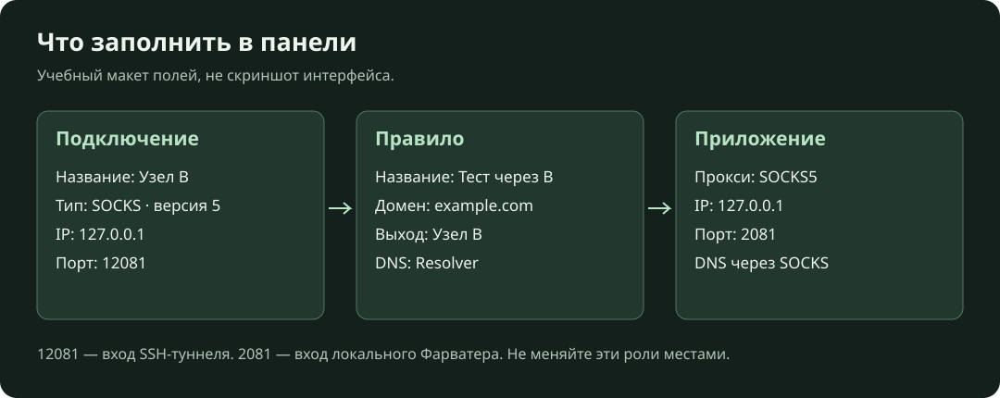
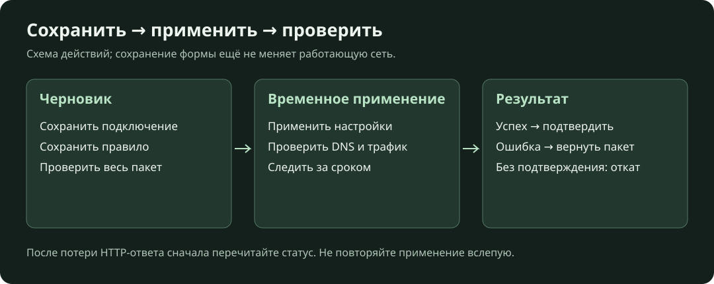

# Сетап с нуля: от установки до первого маршрута

Это инструкция для самостоятельного локального узла на Mac или Linux.
В конце у вас будут работающие DNS, SOCKS/HTTP, веб-панель и проверенный маршрут
через вторую машину. Для полного Linux-сервера используйте [серверную установку](linux.md),
для перехвата системного и LAN-трафика Mac — [руководство шлюза](macos-gateway.md).



## 1. Подготовьте машину

Нужны обычная учётная запись, терминал, Git, Python 3.11+ и доступ в интернет
для загрузки зависимостей и ядра. Эти команды выполняются без `sudo`.

```sh
python3 --version
git --version
```

На Mac Python можно установить с [официального сайта](https://www.python.org/downloads/).
На Linux установите Python, модуль `venv`, Git и curl пакетным менеджером своего
дистрибутива. Например, для Ubuntu 24.04:

```sh
sudo apt update
sudo apt install python3 python3-venv git curl
```

Этот набор нужен локальному узлу; зависимости полного сервера перечислены отдельно
в [Linux-инструкции](linux.md). Если `python3` указывает на старую версию,
используйте путь к установленному Python 3.11+ в команде создания окружения.
Python 3.11 используется в CI; другие версии проверяйте отдельно.

Подготовьте значения:

| Значение | Что указать |
|---|---|
| DNS IP | Адрес DNS-сервера, доступного этой машине; например, DNS вашей сети |
| Administrator login | Имя администратора панели; пустой ввод выбирает `admin` |
| Administrator password | Собственный пароль не короче 12 символов, затем повтор |
| Тестовый домен и HTTPS URL | Доступный адрес без токенов и паролей; примеры ниже используют `example.com` |

Проверяйте доступность DNS из вашей сети. Адрес DNS и адрес следующего узла — разные параметры.

## 2. Получите код и зависимости

```sh
git clone https://github.com/SVS696/farvater.git
cd farvater
git checkout v0.1.0-alpha.2
python3 -m venv .venv
.venv/bin/python -m pip install --require-hashes -r requirements.txt
.venv/bin/python tools/download_core.py --destination "$HOME/.local/share/farvater/core"
```

Здесь выбран фиксированный выпуск. При использовании другого выпуска сверяйте
документацию именно с ним. Загрузчик выбирает архив под ОС/архитектуру и проверяет
его SHA-256. Ошибка загрузки или хеша означает, что продолжать инициализацию нельзя.
Окружение `venv` изолирует Python-зависимости; активировать его не обязательно,
поскольку команды явно используют `.venv/bin/python`.

## 3. Создайте и запустите узел

```sh
.venv/bin/python tools/local_node.py init --core "$HOME/.local/share/farvater/core/sing-box" \
  --probe-domain example.com --probe-url https://example.com/
.venv/bin/python tools/local_node.py serve
```

Ответьте на вопросы из таблицы выше. Ввод пароля не отображается — это нормально.
Успешная инициализация выводит `Local node is initialized`.
Оставьте терминал с `serve` открытым: это процесс ядра и управления узлом.

Во **втором терминале** перейдите в каталог `farvater` и выполните:

```sh
.venv/bin/python tools/local_node.py status
.venv/bin/python tools/run_panel.py --mode local-node
```

Откройте `http://127.0.0.1:18081/login` на этой же машине. Войдите с созданным
логином и паролем. Начальная политика использует **прямой выход**, без VPN-туннеля.



Реальный скрин демонстрационного локального узла: раздел «Изменения» и подсказка об области действия режима.

| Интерфейс | Адрес по умолчанию | Назначение |
|---|---|---|
| Панель | `127.0.0.1:18081` | Управление из браузера |
| SOCKS/HTTP | `127.0.0.1:2081` | Трафик локальных приложений |
| DNS | `127.0.0.1:5301` | Проверка DNS и клиенты с настраиваемым портом |

Если порт занят, задайте `--dns-port`, `--proxy-port`, `--api-port` при первой
инициализации; порт панели меняется параметром `--port` при её запуске.
Не запускайте повторную инициализацию ради изменения работающего узла вслепую.

## 4. Проверьте трафик и подключите приложение

В третьем терминале:

```sh
curl --fail --show-error --proxy socks5h://127.0.0.1:2081 https://example.com/
```

Ожидается HTML-ответ без ошибки curl. Если установлен `dig`, проверьте DNS:

```sh
dig @127.0.0.1 -p 5301 example.com
```

Ожидается ответ DNS без таймаута. Эти проверки относятся к локальному прокси и DNS.

В приложении, которое поддерживает прокси, выберите **SOCKS5**, адрес
**127.0.0.1**, порт **2081**. Для локального входа логин и пароль не нужны.
Если есть переключатель разрешения DNS через SOCKS, включите его.
У HTTP-прокси используется тот же адрес и порт. Проверяйте конкретное приложение:
его собственный DNS, UDP и исключения прокси могут выбирать другой путь.

Системные настройки DNS обычно не позволяют указать порт 5301. Простая подстановка
`127.0.0.1` в системный DNS не подключает этот listener. Для всей ОС или LAN
нужен соответствующий режим шлюза; локальный SOCKS не превращает машину в VPN-шлюз.

## 5. Подключите вторую машину как следующий узел

На машине B сначала запустите и проверьте собственный узел. Нужны её SSH-адрес,
пользователь и ключ доступа. SOCKS должен отвечать на B по `127.0.0.1:2081`.
Проверьте отпечаток SSH-ключа B доверенным способом до подключения.

На машине A откройте отдельный терминал, заменив `user@node-b` своим адресом:

```sh
ssh -o StrictHostKeyChecking=yes -o ExitOnForwardFailure=yes -N \
  -L 127.0.0.1:12081:127.0.0.1:2081 user@node-b
```

Команда остаётся работающей без обычного приглашения shell. Она создаёт защищённый
канал A → B, доступный на A только через loopback. Проверьте его отдельно:

```sh
curl --fail --show-error --proxy socks5h://127.0.0.1:12081 https://example.com/
```



Теперь в панели машины A:

1. Откройте «Подключения» → «Добавить подключение». Выберите SOCKS.
2. Задайте название `Узел B`, назначение «Обычный интернет», IP `127.0.0.1`,
   порт `12081`, версию SOCKS `5`. Для этого SSH-примера оставьте учётные данные пустыми.
3. Сохраните подключение в черновик.
4. Откройте «Правила» → «Добавить правило». Назовите его `Тест через B`,
   задайте точное доменное имя `example.com` и выберите созданный выход `Узел B`.
   В поле DNS выберите начальный профиль `Resolver`. Ограничение по устройствам оставьте пустым; фильтрацию AdGuard не делайте обязательной.
5. В разделе изменений проверьте ошибки и полный состав черновика.
   Нажмите «Применить настройки».
6. Повторите запрос **через порт 2081 машины A**, затем нажмите
   «Проверить и подтвердить» в срок, показанный панелью.



Результат: запрос к выбранному домену идёт A → SSH → B → выход B.
Запрос напрямую к порту 12081 проверяет туннель, а запрос к 2081 — ещё и правило A.
Другие домены продолжают следовать остальным правилам. Для проверки конечного
адреса используйте свой сервис наблюдения; HTML `example.com` сам по себе не показывает выходной IP.

DNS также имеет собственные правила. SOCKS5h передаёт имя прокси, но DNS-политика
узла A не становится автоматически политикой B. Проверяйте её отдельно.
Не задавайте B выход обратно через A: так можно получить цикл.

## 6. Подключите приложение на другой машине LAN

Это отдельный вариант **аутентифицированного SOCKS**, без перехвата всей сети.
Для нового узла при `init` дополнительно задайте, например:

```sh
.venv/bin/python tools/local_node.py init --core "$HOME/.local/share/farvater/core/sing-box" \
  --lan-listen 192.168.77.10 --lan-port 2082 --lan-user client
```

Замените `192.168.77.10` фактическим частным IPv4-адресом машины с Фарватером.
Команда дополнительно спросит пароль SOCKS-клиента. В сетевом экране разрешите
этот порт только нужным клиентам. На клиенте задайте SOCKS5 `192.168.77.10:2082`
и созданную пару логин/пароль. SOCKS сам по себе не шифрует LAN-канал; используйте
его только в доверенной сети или внутри защищённого транспорта.
Панель и локальный DNS продолжают слушать loopback.

## 7. Автозапуск, остановка и состояние

Для первого запуска на Mac остановите ручной `serve` клавишами Ctrl+C,
затем из каталога проекта:

```sh
.venv/bin/python tools/local_node.py install-agent
.venv/bin/python tools/local_node.py status
```

Автозапуск ядра действует при входе этого пользователя, а не до входа в систему.
Панель запускается отдельно. На Linux команда `install-agent` недоступна;
для серверного автозапуска используйте systemd-установку из Linux-инструкции.

При ручном запуске Ctrl+C в терминале `serve` останавливает узел; Ctrl+C
в терминале панели останавливает только панель. Установленный Mac LaunchAgent
перезапускает supervisor, поэтому завершение одного PID не отключает автозапуск.
Для остановки задания текущего пользователя на Mac:

```sh
launchctl bootout "gui/$(id -u)/com.farvater.local-node"
```

Файл задания и состояние сохраняются. Для загрузки задания снова:

```sh
launchctl bootstrap "gui/$(id -u)" "$HOME/Library/LaunchAgents/com.farvater.local-node.plist"
```

Каталог состояния по умолчанию: `~/Library/Application Support/Farvater` на Mac,
на Linux — путь, выбранный по XDG-настройкам (см. `tools/run_panel.py`).
Если используете `--state-dir`, указывайте один абсолютный путь всем командам.
Для переноса сохраняйте состояние приватно; в Git его не добавляйте.

## Готовность

1. Панель открывается, администратор может войти.
2. `status` отвечает, запрос через 2081 и DNS-проверка успешны.
3. Тестовое правило применяется и подтверждается; запрос проходит через выбранную цепочку.
4. Проверено поведение при остановке туннеля: оно соответствует вашим правилам резерва.
5. Известны каталог состояния и способ остановки; ключи сохранены вне репозитория.

Если какой-либо шаг не прошёл, используйте [диагностику](troubleshooting.md).
Полный системный шлюз требует дополнительных сетевых проверок из своей инструкции.
